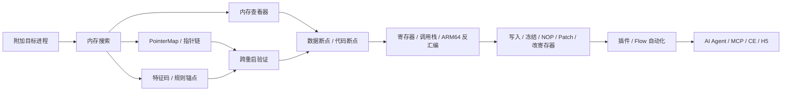

<h1 align="center">MemoryToolkit</h1>

<p align="center">
  <strong>MT 内存工具 · iOS ARM64 动态内存分析与自动化工作台</strong>
</p>

<p align="center">
  从内存搜索、稳定定位、硬件断点和 ARM64 分析，到补丁验证、插件固化、AI / MCP / CE / H5 协作，
  把一次性的分析过程整理成可重复执行的完整工作流。
</p>

<p align="center">
  
  
  
  
</p>

<p align="center">
  <a href="#下载与安装">下载与安装</a> ·
  <a href="#mt-能做什么">核心能力</a> ·
  <a href="#典型工作流">典型工作流</a> ·
  <a href="#ai--mcp--ce--h5">扩展协作</a> ·
  <a href="#兼容性与边界">兼容性</a>
</p>

> MemoryToolkit 是通用技术调试工具，仅用于安全研究、逆向工程学习和已获授权的技术测试，不针对任何特定应用。

## MemoryToolkit 是什么

很多内存工具的主要流程是“搜索数值 → 修改数值”。MemoryToolkit 更关注完整的动态分析闭环：

1. **发现数据**：通过精确、范围、模糊、联合、临近、字符串或 XOR 搜索定位候选地址。
2. **稳定定位**：通过 PointerMap、多级指针、跨重启验证、自动特征码和规则锚点抵抗地址漂移。
3. **解释变化**：通过数据硬件断点、代码断点、寄存器现场、调用栈和 ARM64 反汇编判断谁在读、谁在写、为什么变化。
4. **修改验证**：通过写入、冻结、寄存器修改、NOP 和 ARM64 Patch 验证分析结论。
5. **固化成果**：把指针、特征、规则锚点、补丁和流程脚本整理成可测试、可恢复、可复用的插件。
6. **扩展协作**：通过 AI Agent、MCP、Cheat Engine Server 和 H5 Bridge，把同一套底层能力接入不同分析入口。

如果只看单个功能，MT 像一款内存工具；如果看完整链路，它更接近一套运行在 iPhone 上的 **ARM64 动态内存分析与自动化工作台**。

## 下载与安装

请从本仓库的 [Releases](https://github.com/susu123oss/MemoryToolkit-Release/releases) 下载与你设备环境匹配的安装包。

| 设备环境 | 安装包 | 说明 |
| --- | --- | --- |
| **TrollStore** | `MemoryToolkitApp-vX.Y.Z.tipa` | 独立 App，适合 TrollStore 环境 |
| **rootful 越狱** | `MemoryToolkitApp-vX.Y.Z-rootful.deb` | 安装到 `/Applications/MemoryToolkitApp.app` |
| **rootless 越狱** | `MemoryToolkitApp-vX.Y.Z-rootless.deb` | 安装到 `/var/jb/Applications/MemoryToolkitApp.app` |
| **RootHide** | `MemoryToolkitApp-vX.Y.Z-roothide.deb` | 使用 RootHide 对应安装包 |

> TIPA 与三种 DEB 面向不同运行环境，请不要混装。跨进程内存访问、系统级悬浮窗和硬件断点能力仍取决于设备权限、系统版本与当前越狱 / TrollStore 环境。

## MT 能做什么

### 内存搜索与结果管理

支持常用整数、浮点和字符串数据类型：

- I8 / I16 / I32 / I64
- U8 / U16 / U32 / U64
- F32 / F64
- UTF-8 / UTF-16LE 字符串
- Hex / 原始字节查看

主要搜索方式：

- 精确搜索
- 改善搜索
- 范围搜索
- 模糊搜索：变大、变小、变化、未变化、等于
- Delta 模糊搜索
- 联合搜索
- 混合类型联合搜索
- 临近搜索
- 字符串搜索
- XOR 搜索
- 搜索撤销

搜索结果支持批量修改、冻结 / 解冻、偏移、收藏、删除以及大结果集处理。

### 内存查看器

内存查看器可用于继续确认地址周围上下文：

- 绝对地址跳转
- 模块 + 偏移跳转
- 数值 / Hex 查看
- 原地刷新
- 指针跳转历史
- ARM64 汇编视图
- 从指针、断点和调用栈继续跳转

### PointerMap 与多级指针

用于把动态地址转换为更稳定的定位方式：

- PointerMap 快速搜索
- Legacy 指针搜索
- 多级指针链
- 正负偏移
- 循环检测
- 地址有效性检查
- PAC 指针处理
- 大结果集磁盘存储
- 指针文件保存与批量验证
- 多文件交叉验证
- 跨重启稳定性验证
- 导出到插件

当原链失效时，MT 还可以尝试附近纠偏、块扫描和搜索引擎救援，而不是简单丢弃结果。

### 自动特征码与规则锚点

除了指针链，MT 还提供两种稳定定位方案。

**自动特征码**支持：

- 向上 / 向下 / 双向扫描
- 两次地址快照比较
- 稳定原始字节特征提取
- 特征质量评分
- 快照持久化
- 测试匹配
- 导出插件

**规则锚点**支持：

- 搜索值与数据类型
- 最小 / 最大地址范围
- 多个偏移条件
- 多个偏移写入

### 数据硬件断点

当你已经知道“哪个数据在变化”，可以继续追踪“谁在读写它”。

支持：

- Read
- Write
- Read / Write
- 1 / 2 / 4 / 8 字节监控
- 命中次数
- 旧值 / 新值
- 实际读写类型判断
- 来源 PC 过滤
- 命中现场汇编
- 调用栈
- 寄存器快照

受 ARM64 调试资源限制，当前最多管理 4 个数据硬件断点。

### BVR 代码断点与寄存器

从数据断点追到具体 ARM64 指令后，可以继续使用代码断点观察执行现场。

支持：

- BVR 硬件代码断点
- 启用 / 停用但保留条目
- 命中次数和模块偏移
- 当前 / 上一次寄存器对比
- 按返回地址 LR 过滤
- 保留暂停线程现场
- 修改寄存器
- Resume 恢复执行

断点现场可查看：

- x0-x28
- FP / x29
- LR / x30
- SP
- PC
- PSTATE / NZCV
- 栈数据
- 模块名 + 模块偏移
- IDA 风格地址
- 调用栈

### ARM64 反汇编、汇编与补丁

MT 内置 ARM64 分析能力：

- 单条反汇编
- 连续反汇编
- 函数级反汇编
- 函数边界识别
- 条件 / 无条件分支目标解析
- ARM64 → 机器码
- 机器码 → ARM64
- PC 相对指令处理
- 远距离条件分支展开
- NOP
- Patch
- Restore

补丁会保留原始字节和修改字节，方便停用、恢复和冲突检查。

### 插件与自动化流程

MT 的插件不是简单保存一个地址，而是可以组合不同定位与修改方式。

当前主要插件项目类型：

- **Pointer**：多级指针链
- **Patch**：ARM64 / 原始机器码补丁
- **Signature**：自动特征码定位
- **Rule Anchor**：规则式锚点定位与写入
- **Flow**：搜索、筛选、判断和写入组成的自动化流程

Flow 可以把“先搜什么 → 再筛什么 → 最后改哪里”这类人工步骤整理成结构化流程，并支持条件分支、循环写入和偏移写入。

插件制作器提供测试和恢复能力，便于正式生成前验证配置。

## 典型工作流



一个比较完整的分析过程通常是：

```text
数值 / 行为变化
  ↓
搜索候选地址
  ↓
稳定定位（Pointer / Signature / Rule Anchor）
  ↓
数据硬件断点
  ↓
找到真实读写指令
  ↓
代码断点 + 寄存器 + 调用栈
  ↓
ARM64 反汇编
  ↓
修改 / NOP / Patch 验证
  ↓
保存为插件或自动化流程
```

这也是 MT 与单纯“内存搜索器”最大的区别：**发现地址只是分析的起点，不是终点。**

## AI / MCP / CE / H5

### AI Agent

内置 AI 不只是解释文本，它可以通过统一 Tool 层读取实际分析现场，包括：

- 进程与状态
- 内存读取 / 写入
- 搜索结果
- 模块与地址解析
- 数据 / 代码断点
- 断点命中等待
- 寄存器
- 调用栈
- ARM64 反汇编
- 汇编
- NOP / Patch
- Patch 验证
- 添加 Patch 到插件

AI Provider 支持 OpenAI / Anthropic 协议以及自定义 Base URL、模型和 Thinking Level。

> AI 分析结果应结合真实寄存器、内存和汇编现场人工复核。

### MCP Server

MT 内置 MCP HTTP/SSE Server，可让支持 MCP 的桌面客户端调用手机上的部分实时分析能力。

适合：

- USB 端口转发
- 可信 Wi-Fi 局域网
- 桌面端 AI / 自动化工具协助手机分析

> MCP 属于高权限调试接口，只建议在可信网络或 USB 转发环境中启用，不要直接暴露到不可信网络。

### Cheat Engine Server

MT 内置 CE 协议服务，可让 PC 端 Cheat Engine 通过 Wi-Fi 或 USB / iproxy 连接手机。

建议使用 CE 7.5+，推荐 CE 7.6。

### H5 Bridge

H5 页面可以作为另一种浮动操作前端，当前兼容常用 H5GG 风格接口，包括：

- 进程列表 / 目标进程选择
- 搜索 / 改善搜索 / 临近搜索
- 获取结果
- 读值 / 写值 / EditAll
- 模块列表
- 原始字节写入
- 浮动按钮与 H5 窗口控制
- 横竖屏布局回调

这是兼容子集，不承诺完整 H5GG API。

## 手机端交互

MT 针对真实 iPhone 调试场景提供独立的系统级悬浮交互：

- Portrait / LandscapeLeft / LandscapeRight
- 跟随前台目标 App 方向
- 横竖屏独立位置
- 前台 / 后台交互
- 触摸坐标修正
- 锁屏销毁与解锁重建
- 中文 / English
- 浅色 / 深色 / 跟随系统
- 内置拼音输入
- H5 输入桥接

因此在分析目标 App 时，不需要频繁在 MT 和目标程序之间来回切换。

## 兼容性与边界

| 项目 | 当前范围 |
| --- | --- |
| **系统** | iOS 14.0+ |
| **架构** | iPhoneOS arm64；RootHide 使用对应 arm64e 打包环境 |
| **安装方式** | TrollStore TIPA、rootful / rootless / RootHide DEB |
| **悬浮窗** | 支持竖屏和左右横屏，并跟随前台 App 方向 |
| **数据硬件断点** | 当前最多管理 4 个，受 ARM64 调试资源和环境权限限制 |
| **代码断点** | BVR 硬件代码断点，能力取决于设备与目标进程权限 |
| **Cheat Engine** | 建议 CE 7.5+，推荐 7.6 |
| **AI** | 需要自行配置可访问的 Provider / Base URL / API Key / 模型 |
| **MCP** | HTTP/SSE 高权限调试接口，仅建议可信网络或 USB 转发环境 |
| **H5** | 提供常用 H5GG 风格兼容映射，不承诺完整 API |

不同环境下硬件断点能力可能不同。MT 会根据设备和权限环境进行能力检测与降级，部分环境只能使用有限的调试能力。

## 使用建议

如果你第一次使用 MT，可以按下面的顺序理解功能：

1. 先掌握 **内存搜索 + 内存查看器**。
2. 地址会漂移时，再学习 **PointerMap / 指针链 / 特征码**。
3. 想知道数据为什么变化，再使用 **数据硬件断点**。
4. 找到代码后，再进入 **寄存器 / 调用栈 / ARM64 反汇编**。
5. 验证修改逻辑后，再使用 **Patch / Plugin / Flow** 固化成果。
6. 最后根据需要接入 **AI / MCP / CE / H5**。

这样更容易理解 MT 的设计逻辑，也能避免一开始就被大量功能淹没。

## 使用边界

- 仅在您拥有、开发或已获得明确测试许可的目标上使用。
- 不得用于非法侵入、数据窃取、破坏服务公平性或其他违反法律法规的行为。
- 内存写入、进程冻结、硬件断点、寄存器修改和 ARM64 补丁都可能造成目标进程崩溃或数据损坏，请保留回滚方案。
- AI 输出、MCP 自动化和插件流程应结合真实寄存器、内存和汇编现场人工复核。
- MCP、CE 等高权限远程入口只建议在可信网络或 USB 转发环境中启用。

---

<p align="center">
  <strong>MemoryToolkit</strong><br>
  从发现地址，到稳定定位；从解释现场，到固化为可重复执行的方案。
</p>
